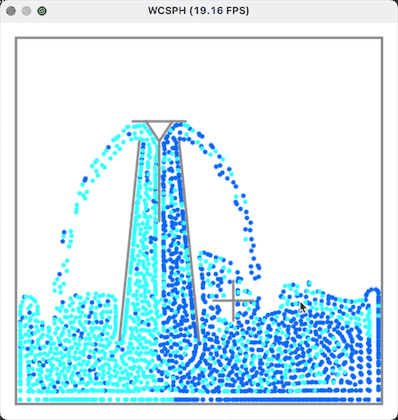

# 太极图形课S1-【大作业】喷泉模拟

## 作业来源
> 参考了《太极图形课S1》的WCSPH代码。
> 
> 尝试实现课程中提到的 One way coupling
> 
> 主题是简单的喷泉模拟。

## 运行方式
#### 运行环境：
```
[Taichi] version 0.8.5, llvm 10.0.0, commit 45c6ad48, osx, python 3.7.3
[Taichi] Starting on arch=x64
```

#### 运行：
`python3 demo.py`

## 效果展示
> 

## 整体结构
```
├── LICENSE
├── README.MD
├── data
│   └── WCSPH_Fountain.gif
├── demo.py
├── particle_system.py
├── sph_base.py
└── wcsph.py
```

## 实现细节：
`demo.py particle_system.py sph_base.py wcsph.py`是项目源代码，其中包含SPHBase类、WCSPHSolver类、ParticleSystem类和一个`main`函数。

具体公式推导，可以看: [here](https://github.com/taichiCourse01/taichiCourse01/blob/main/material/10_fluid_lagrangian.pdf) (P77-78)。

### 整体流程
1. 粒子系统的初始化。
2. 创建一个GUI来显示粒子和边界。
3. 使用 WCSPHSolver 来更粒子的状态。
4. 在GUI中显示粒子和边界。


### ParticleSystem类
1. [初始化](hhttps://github.com/kphmd/WCSPH_Fountain/blob/master/particle_system.py#L8)
   - 设置field，确定数据结构
   - 初始化field，设置位置，速度，质量和边界
   - 使用太极语言的稀疏数据结构【改进部分】
2. 移动可交互边界 [`mv_cross(x,y)`](https://github.com/kphmd/WCSPH_Fountain/blob/master/particle_system.py#L946)
3. 增加粒子 [`add_particles`](https://github.com/kphmd/WCSPH_Fountain/blob/master/particle_system.py#L120)
4. 查找邻域的粒子[`search_neighbors`](https://github.com/kphmd/WCSPH_Fountain/blob/master/particle_system.py#L173)

### WCSPHSolver类
1. 计算密度 [`compute_densities`](https://github.com/kphmd/WCSPH_Fountain/blob/master/wcsph.py#L16)
2. 计算压力 [`compute_pressure_forces`](https://github.com/kphmd/WCSPH_Fountain/blob/master/wcsph.py#L27)
3. 计算非压力 [`compute_non_pressure_forces`](https://github.com/kphmd/WCSPH_Fountain/blob/master/wcsph.py#L43)
   - 粒子之间的粘性力
   - 粒子受到的重力
   - 喷泉向上的动力(line59)
4. 更新速度和位置[`advect`](https://github.com/kphmd/WCSPH_Fountain/blob/master/wcsph.py#L64)
   - Symplectic Euler
5. 流程控制[`substep`](https://github.com/kphmd/WCSPH_Fountain/blob/master/wcsph.py#L76)
``` python
 def substep(self):
     self.compute_densities()
     self.compute_non_pressure_forces()
     self.compute_pressure_forces()
     self.advect()
```


### SPHBase类
1. 核函数 [`cubic_kernel`](https://github.com/kphmd/WCSPH_Fountain/blob/master/sph_base.py#L21)
2. 核函数导数 [`cubic_kernel_derivative`](https://github.com/kphmd/WCSPH_Fountain/blob/master/sph_base.py#L43)
3. 粘性力的贡献 [`viscosity_force`](https://github.com/kphmd/WCSPH_Fountain/blob/master/sph_base.py#L68)
4. 压力的贡献 [`pressure_force`](https://github.com/kphmd/WCSPH_Fountain/blob/master/sph_base.py#L78)
5. 获取碰撞后的速度 [`get_new_velocity`](https://github.com/kphmd/WCSPH_Fountain/blob/master/sph_base.py#L89)
6. 粒子和边界的碰撞 [`segment_collision`](https://github.com/kphmd/WCSPH_Fountain/blob/master/sph_base.py#L102)
   - 碰撞后粒子的中心位置和边界的距离大小为粒子半径。
   - 碰撞后粒子的边界法向速度反向,边界法向速度服从Coulomb's Law（参考GAMES103的PPT_04_P13）。
7. 粒子和边界的碰撞调用 [`enforce_boundary`](https://github.com/kphmd/WCSPH_Fountain/blob/master/sph_base.py#L153)
8. 流程控制 [`step`](https://github.com/kphmd/WCSPH_Fountain/blob/master/sph_base.py#L160)
``` python
 def step(self):
     self.ps.initialize_particle_system()
     self.substep()
     self.enforce_boundary()
```


